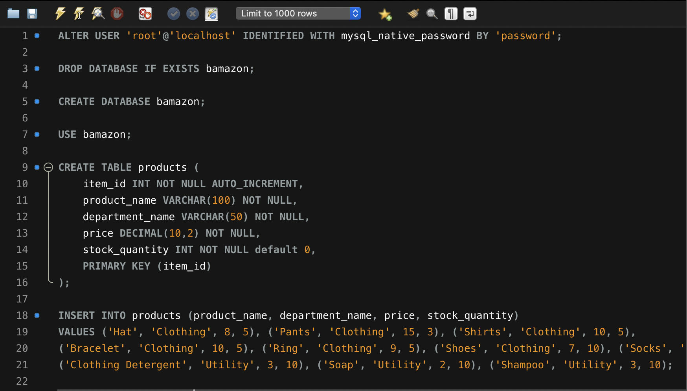

# bamazon

A terminal window application utilizing node and sql to mimick a fully operational online store-front.

## Getting Started

This application required node.js [node.js](https://nodejs.org/en/) and uses MySQL workbench [sql-workbench](https://www.mysql.com/products/workbench/) to establish a local database.

### Installation

After installing all the neccessarry "getting started" programs, install application to an accessible directory. Once installed, navigate to the directory to access the SQL scripts to be used in your SQL application. Open the .sql files in a text editor, and copy/paste the contents into yout SQL application to run the script.



Once the script has run, our initial database has been set up. 

Next, navigate to the application directory in your terminal window. Using node, we will install the package dependecies used for this application by typing

```
npm i
```

Once these packages are installed, we are ready to use the application.

## Usage

### bamazonCustomer

Using node, run the first application from in the terminal by navigating to the directory containing the application and typing

```
node bamazonCustomer.js
```

Once running, you will be presented with the option to "shop".

[customer-shop.png](read-me/customer-start.png)

Selecting this option will present us with a list of items to choose from, as well as a prompt to type the ID of the item we want to buy, followed by a prompt to input the amount we want to buy.

[customer-shop.png](read-me/customer-shop.png)

(npm package inquirer WILL validate that both of these inputs are numbers, and if they are not, it will not continue.)

Once the item is successfully bought, the customer will be shown a confirmation message, and taken back to the homescreen where they can continue shopping or exit the application. 

[customer-bought.png](read-me/customer-bought.png)

If the customer inputs an invalid amount (too many to buy or if the item is sold out), the user will be presented with an "insufficient stock" message, and prompted to select another item.

[customer-insufficient.png](read-me/customer-insufficient.png)

### bamazonManager

Using node, run the second application from in the terminal by navigating to the directory containing the application and typing

```
node bamazonManager.js
```

Once running, the user will be prompted with 4 options

[manager-start.png](read-me/manager-start.png)

The first option will simply show the manager a list of items for sale with price, stock, and department type.

[manager-stock.png](read-me/manager-stock.png)

The second option will display all low inventory (items with less than 3 in stock) in the same format as the first before returning you back to the home screen.

[manager-lowInv.png](read-me/manager-lowInv.png)

The third option will allow the user to add to a current products inventory by simply typing the ID number and the amount of stock you are adding before returning you back to the home screen.

[manager-addInv.png](read-me/manager-addInv.png)

The last option will add a new product to our list. Simply enter the name, type, price, and stock for the item when prompted and it will be added before returning you to the home screen.

[manager-addItem.png](read-me/manager-addItem.png)

Finally, exit the application by selecting "exit" from the home screen.

## Built With
* [node.js](https://nodejs.org/en/) - for terminal javascript
* [sql-workbench](https://www.mysql.com/products/workbench/) 
* [npm package - mysql](https://www.npmjs.com/package/mysql)
* [npm package - inquirer](https://www.npmjs.com/package/inquirer)

## Authors
Paul Davis - UCF Continuing Education Coding Bootcamp

